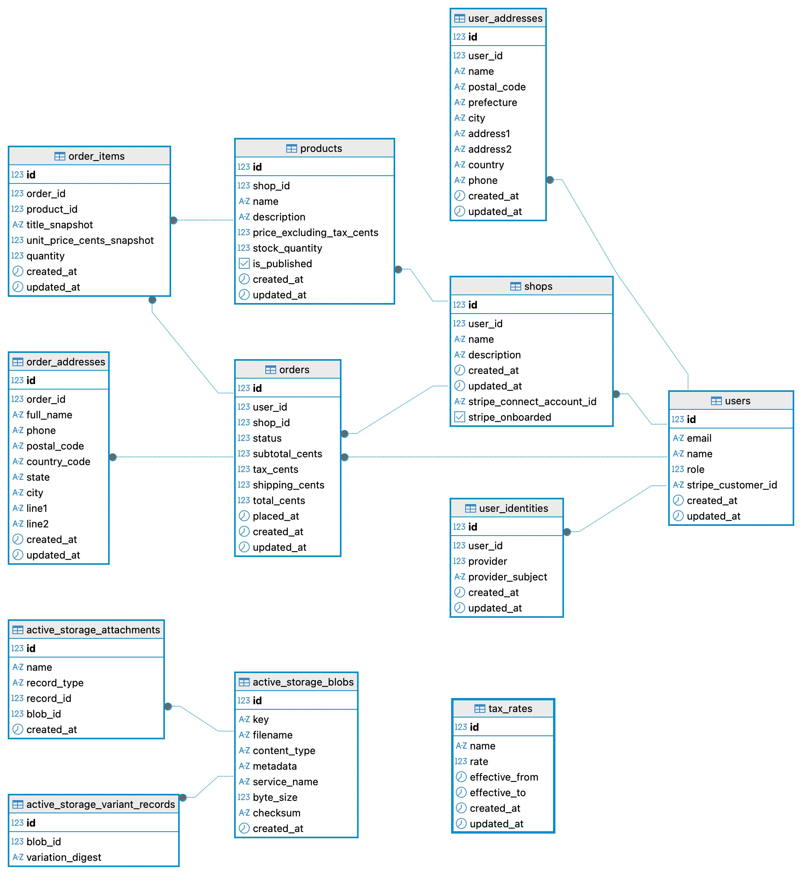

# README

これはShuのポートフォリオの、Digital Ichibaのバックエンドのリポジトリです。

## 概要
Digital Ichibaは、ハンドメイド作家や衣料品、雑貨、生活用品などの小規模セレクトショップのオーナー向けに、
5分でオンラインショップを開設できるECプラットフォームです。
シングルページアプリケーション（SPA）によるスムーズな操作性と、Stripeによる信頼性の高い決済機能を搭載。
在庫管理やモバイル最適化も完備し、日常の投稿からそのまま販売につなげられます。
誰でもスムーズに販路を広げ、ブランドの魅力を最大限に発信できる環境を提供します。

## 主な機能
- マルチテナント対応のショップ管理
- JWT（Auth.js）によるAPI認証
- Stripe Checkout / Connectによる決済・分配
- 商品・在庫管理
- 注文・配送情報の管理

## バージョン情報
- Ruby 3.3.9
- Rails 8.0.2.1
- PostgreSQL 16.10
- Docker 28.4.0

## リソース表
| Method | Path | 説明 |
| --- | --- | --- |
| GET | /up | ヘルスチェック（Rails標準） |
| POST | /api/login | ログイン（JWT検証→ユーザー/ショップ情報返却） |
| GET | /api/shop | 自分のショップ取得 |
| POST | /api/shop | ショップ作成 |
| PATCH | /api/shop | ショップ更新 |
| PUT | /api/shop | ショップ更新 |
| GET | /api/shop/orders | 自分のショップの受注一覧 |
| GET | /api/shop/orders/:id | 自分のショップの受注詳細 |
| GET | /api/shops | ショップ一覧 |
| GET | /api/shops/:id | ショップ詳細 |
| POST | /api/products | 商品作成 |
| GET | /api/products | 商品一覧（条件付き取得あり） |
| GET | /api/products/:id | 商品詳細 |
| PATCH | /api/products/:id | 商品更新 |
| PUT | /api/products/:id | 商品更新 |
| DELETE | /api/products/:id | 商品削除 |
| GET | /api/orders | 注文一覧（ユーザー） |
| GET | /api/orders/:id | 注文詳細（ユーザー） |
| POST | /api/stripe_connect | Stripe Connect（オンボーディング/ログインURL発行） |
| POST | /api/stripe_checkout | Stripe Checkout（決済セッション作成） |
| POST | /api/stripe/webhooks/connect | Connect Webhook |
| POST | /api/stripe/webhooks/checkout | Checkout Webhook |

## ER図


## Setup
```bash
docker compose up
```

## 環境変数
開発では、最低限DB接続とJWT検証の設定が必要です（`.env` に入れる想定）。

```bash
# DB（PostgreSQL）
DB_HOST=db
DB_NAME=digital_ichiba_development
DB_USER=postgres
DB_PASSWORD=postgres

# Next→Rails API のJWT検証（公開鍵）
# ※Next側の APP_JWT_PRIVATE_KEY とペアになります
APP_JWT_PUBLIC_KEY="-----BEGIN PUBLIC KEY-----\n...\n-----END PUBLIC KEY-----\n"
APP_JWT_ISS=digital-ichiba-next
APP_JWT_AUD=digital-ichiba-rails

# Stripe（サーバー側）
STRIPE_SECRET_KEY=sk_test_xxx

# Stripe Webhooks
STRIPE_CHECKOUT_WEBHOOK_SECRET=whsec_xxx
STRIPE_CONNECT_WEBHOOK_SECRET=whsec_xxx

# CORS/リダイレクト等に使用（フロントURL）
NEXT_URL=http://localhost:3001

# 手数料・送料（数値）
PLATFORM_FEE_PERCENT=0.04
SHIPPING_CENTS=500
```

### ざっくり用途
- **`DB_*`**: DB接続情報（`docker compose` の `db` と合わせる）
- **`APP_JWT_PUBLIC_KEY / APP_JWT_ISS / APP_JWT_AUD`**: Nextから来るJWTの検証用
- **`STRIPE_SECRET_KEY`**: Stripe API呼び出し用の秘密鍵
- **`STRIPE_*_WEBHOOK_SECRET`**: Webhook署名検証用（Checkout / Connect）
- **`NEXT_URL`**: フロントのURL（CORSやStripeのリダイレクトで使用）
- **`PLATFORM_FEE_PERCENT`**: プラットフォーム手数料
- **`SHIPPING_CENTS`**: 送料